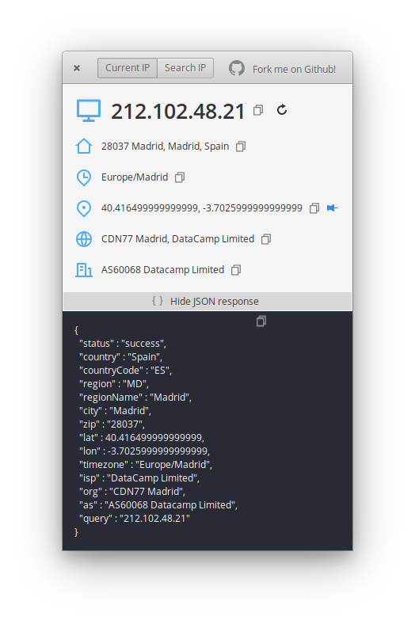
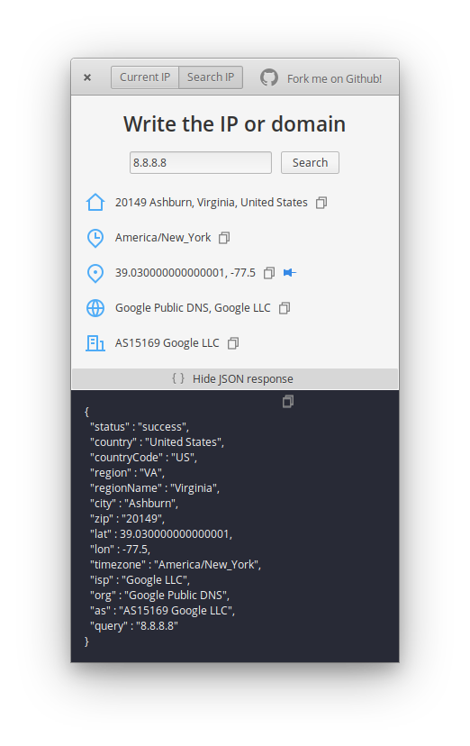
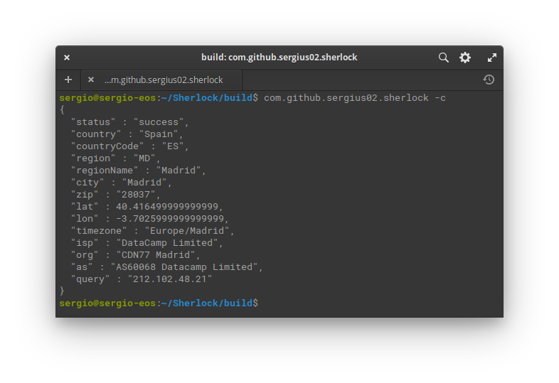
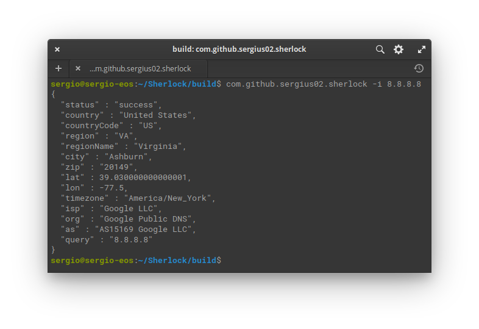

<p align="center">
  
</p>
<h1 align="center">Sherlock</h1>


| ||
|---------------------------------|---------------------------------|
|||

<p align="center">
  <a href="https://appcenter.elementary.io/com.github.sergius02.sherlock"></a>
</p>

With Sherlock you can find information about your current IP or search for public IP addresses information , elementary! 🕵️

## Dependencies

Ensure you have these dependencies installed

* valac
* glib-2.0
* gtk+-3.0
* libsoup-2.4
* json-glib-1.0

## Install, build and run

```bash
# FOR ELEMENTARY OS USERS
sudo apt install elementary-sdk

# FOR THE REST
sudo apt install cmake libgtk-3-dev gettext libjson-glib-dev libsoup2.4-dev

# clone repository
git clone https://github.com/sergius02/Sherlock Sherlock

# cd to dir
cd Sherlock

# run meson
meson build --prefix=/usr

# cd to build
cd build

# build
ninja

# install
sudo ninja install
```

## Credits

* [IP-API](https://ip-api.com/)
* [REMIXICON](https://remixicon.com/)
* [Visual studio code](https://code.visualstudio.com/)
* App icon from [Flaticon](https://www.flaticon.es/)

----------

If you like my work you can

<a href="https://www.buymeacoffee.com/sergius02" target="_blank"></a>
