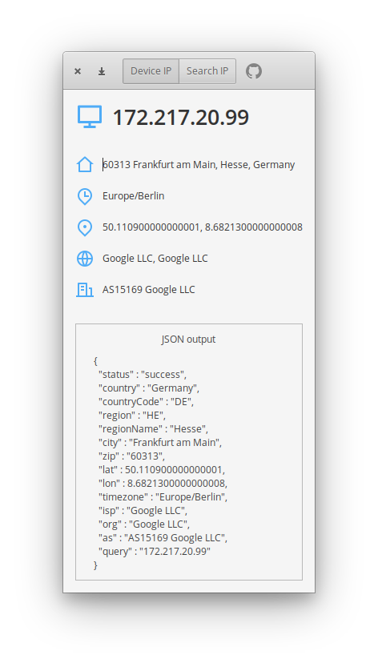

# Sherlock

Sherlock helps you to find information of public IP address, elementary! 🕵️



# Install it from source

You can of course download and install this app from source.

## Dependencies

Ensure you have these dependencies installed

* valac
* glib-2.0
* gtk+-3.0
* libsoup-2.4
* json-glib-1.0
* gee-0.8
* gmodule-2.0

## Install, build and run

```bash
# install elementary-sdk, meson and ninja
sudo apt install elementary-sdk meson ninja
# clone repository
git clone https://github.com/sergius02/Sherlock Sherlock
# cd to dir
cd Sherlock
# run meson
meson build --prefix=/usr
# cd to build, build and test
cd build
ninja && ./Sherlock
```

----------
This is my first Vala application, be gentle 😹️